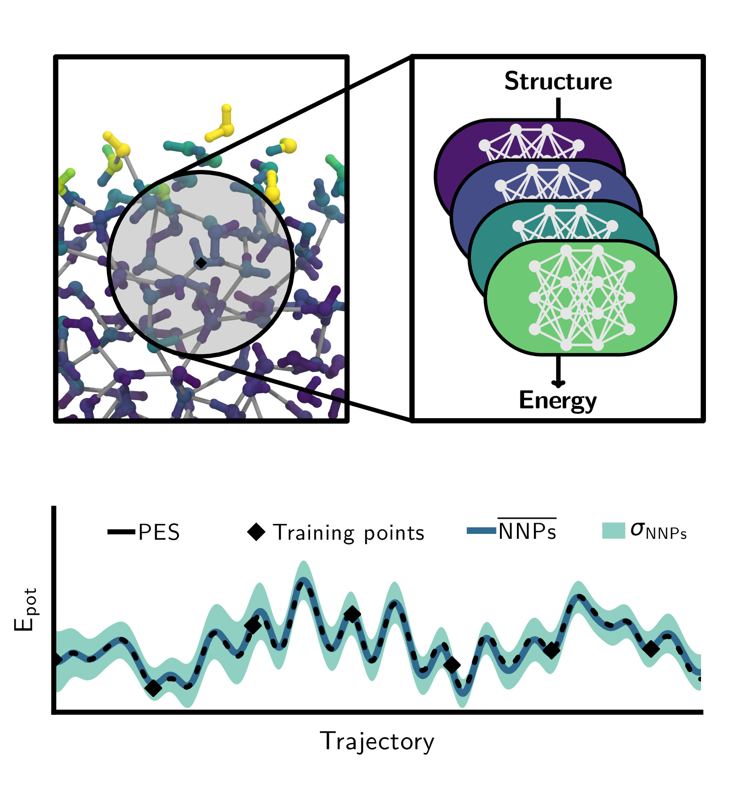

# MPhil in Scientific Computing - University of Cambridge
## Advanced Atomistic Simulation Techniques Course - Practical 1

## Development of a Machine Learning Potential for Ice

### Introduction
In this practical, we will learn how to train a machine learning potential (MLP) to AIMD data.
We will concentrate on the most stable phase of ice on our planet, ice Ih, which has a hexagonal lattice and proton-disorder.
In a first step, we will run a short AIMD simulation.
Next, we will use this trajectory and train a Committee Neural Network Potential.
After using this for an extended simulation, we will then check its validity.

### Simulations

#### Before you start

We will run this practical on one of the cerberus clusters that you have access to.
All software required for the completion has been installed there.

Adapt the following ssh command to your needs, please distribute over the three available clusters:\
`ssh -X USER@cerberus1/2/3.lsc.phy.private.cam.ac.uk`

For the rest of the practical work within a directory under `/data/cerberus1/2/3`. For example, if you logged into cerberus2, create a directory under your username:\
`mkdir /data/cerberus2/$USER`

Change to this directory and clone the github repository of this practical:\
`git clone https://github.com/cschran/mphil-aast-practical1.git`

Once you are in the directory, execute the following command to setup the correct system environment:\
`source setup.sh`

### Run AIMD simulation
The directory `01-AIMD-ice` contains the input files for running a short NVT simulation of ice Ih using 96 molecules of water in a periodic box.

The simulation can be launched with the following command:\
`mpirun -n 4 /data/cerberus1/cs2121/cp2k/exe/Linux-intel-x86_64/cp2k.popt aimd.inp > aimd.out &`

Note that this is quite slow. Take a look at the output to understand what the bottleneck is.

To get reasonable insight into the structure and dynamics of ice, we would need to obtain a trajectory that is roughly 20 ps long.
Estimate how long this will take on this machine.

Luckily, there are bigger computing resources available on which this can run faster. Under `._RESULTS./01-AIMD-ice` you can find the output of a 4 ps long simulation.

### Train C-NNP model
In the next step, we will use a subset of the generated configurations to train a machine learning potential. `02-MLP-train` contains the relevant input files.

The training can be started with the following command:\
`python3 create-model.py`

This will again take some time. While this is running, take a look at the `jupytler-notebook`, described at the end of this description.

### Run C-NNP simulation
We now have everything to use our model in a simulation. `02-MLP-ice` contains the relevant input files.

The simulation can be launched with the following command:\
`mpirun -n 4 /data/cerberus1/cs2121/cp2k/exe/Linux-intel-x86_64/cp2k.popt aimd.inp > aimd.out &`

Do you realise a difference in speed?

### Perform validation
In order to find out how good our model reproduces the reference AIMD simulation, we need to perform validation tests.
`04-validation` contains a python based analysis script to check how well your MLP simulation matches the AIMD reference for various properties.

This validation test can be performed with the following command:\
`python3 score-all.py`

### Timing Comparison
Using your obtained timings for the AIMD and CNNP simulations, compute the speed-up enabled by the MLP.

## Analysis within jupyter-notebook
Juptyer notebook is a web application for creating and sharing computational documents.
It offers a simple, streamlined, document-centric experience and has become a standard tool in the field to perform quick analysis and write code.

You can start a notebook on cerberus and then access it on your local machine.
In the main directory of the repository, execute `juptyer-notebook --no-browser`. This will lock up this session, so it is best to do it in a new terminal.

On your local machine, you can then use ssh to tunnel into the running session (replace XXXX to match the network address shown the by jupyter notebook):\
`ssh -N -y -L localhost:XXXX:localhost:XXX USER@cerberus1/2/3.lsc.phy.private.cam.ac.uk`

Copying the shown network address into your local browser will allow you to access the session:\
`http://localhost:8888/?token=8d186032bbbe095b294789e863b065a546fcc15b68683c99`
